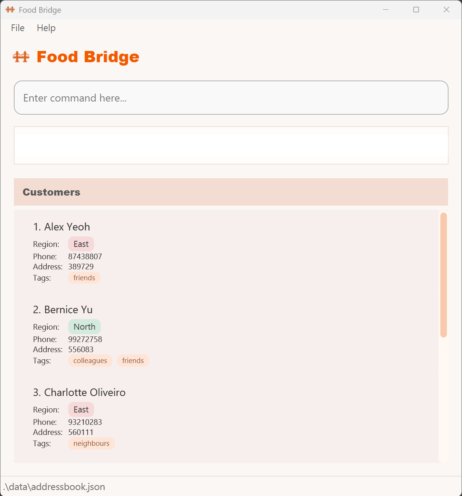

* Food Bridge is an application that aims to help restaurant delivery workers organize and sort contacts and orders so that they can manage pickups and dropoffs more efficiently.
  * The application allows users to identify customers with active orders in the same region, helping them group and organise deliveries more efficiently.
* This project is an ongoing software project for a desktop application (called _Food Bridge_) used for managing contact details of customers for a food delivery service.
  * It is **written in OOP fashion**.
  * It comes with a **reasonable level of user and developer documentation**.
* For the detailed documentation of this project, see our **[Product Website](https://ay2526s2-cs2103t-t12-4.github.io/tp/)**.
